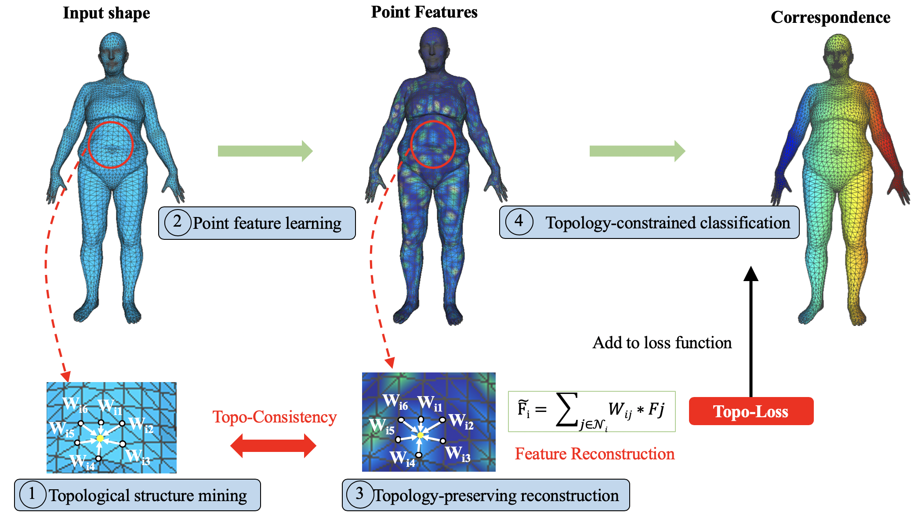
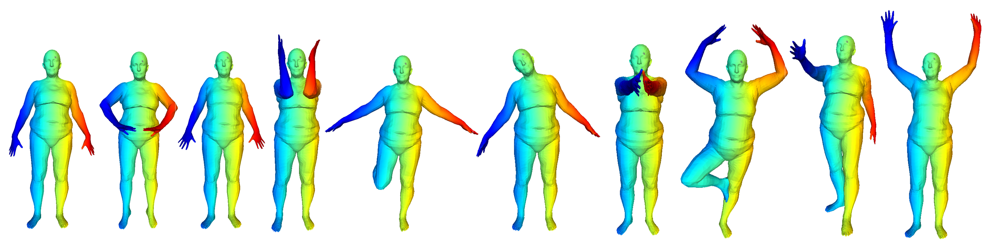

# Topology-constrained Shape Correspondence


Introduction
------------
This is the source code for our paper **Topology-constrained Shape Correspondence**


Network Architecture
--------------------
The architecture of our proposed model is as follows



--------------------
Illustration of shape morphing.


## Installation
* Our code is tested on Tensorflow>1.4 and CUDA 8.0 

* Clone this repo
```
git clone https://github.com/lixiang-ucas/PCNet.git

```
## Dataset
* Download the dataset from http://faust.is.tue.mpg.de/

run notebook file [Data]Faust-FeastNet.ipynb to prepare the tfrecords


## Training & Test
run the notebook: training_faust.ipynb


## Citation

If you find this useful in your research, please consider citing:

    @article{li2020topology,
	  title={Topology-Constrained Shape Correspondence},
	  author={Li, Xiang and Wen, Congcong and Wang, Lingjing and Fang, Yi},
	  journal={IEEE Transactions on Visualization and Computer Graphics},
	  year={2020},
	  publisher={IEEE}
	}
